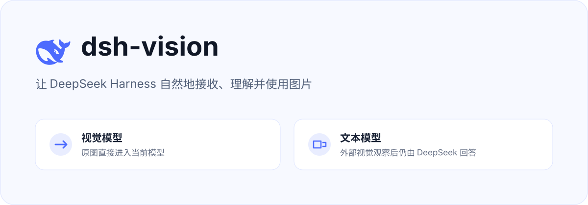

<p align="center">
  
</p>

<p align="center">
  <a href="./README.md">English</a> | 中文
</p>

<p align="center">
  <a href="https://github.com/narger18/dsh-vision/actions"></a>
  <a href="./LICENSE"></a>
  
  
</p>

`dsh-vision` 是 DeepSeek Harness 的通用插件，提供以下核心功能：

- **通用视觉桥接** — 支持任意 LLM 提供商（deepseek-official、cpa、自定义网关）。当主模型无法识别图像时，插件会自动调用独立的视觉模型进行观察。
- **可扩展自定义视觉模型** — 支持 Anthropic Claude、Google Gemini、OpenAI GPT-4 及自定义 OpenAI 兼容 API。
- **图片生成功能** — 使用 OpenAI DALL·E、Stability AI 或自定义提供商从文本提示生成图片。
- **视频生成功能** — 使用 Runway、Pika 或自定义 API 生成视频（支持异步处理）。
- **增强的 UI 配置面板** — 在设置界面中直观配置各个功能模块。

## 工作原理

| 功能 | 行为说明 |
| --- | --- |
| **视觉识别（图像理解）** | 任何仅支持文本的提供商都会自动启用视觉桥接 |
| **自定义提供商** | 在插件配置中添加自己的视觉模型 |
| **图片生成** | 通过类似"生成一张...的图片"的提示触发 |
| **视频生成** | 通过类似"创建一个...的视频"的提示触发 |

插件会自动检测您配置的提供商 —— 无需硬编码依赖 DeepSeek 官方 API。

## 安装

### 方法一：通过 DeepSeek Harness 插件管理器

```bash
npx @deepseek-ai/dsh plugin --profile web add github:narger18/dsh-vision
```

### 方法二：直接安装

```bash
pnpm add @narger18/dsh-vision
```

### 中国用户特别提示

如果您在中国大陆，建议使用国内镜像加速安装：

```bash
pnpm add @narger18/dsh-vision --registry=https://registry.npmmirror.com
```

或者配置 npm 全局镜像：

```bash
npm config set registry https://registry.npmmirror.com
```

安装完成后，重新启动 Harness。插件会在 **设置 → 插件** 中添加三个配置卡片：

1. **视觉识别** — 图像理解提供商配置
2. **图片生成** — 图片创建（DALL·E、Stability AI）
3. **视频生成** — 视频创建（Runway、Pika）

> DeepSeek Harness 仍处于 Developer Preview 阶段。当前版本兼容 `0.1.0-rc.6` 和 `0.1.0-rc.7`；设置卡注册同时满足旧版 list Slot 和当前 keyed Slot，不依赖私有的运行时探测接口。

## 配置视觉识别

打开 **设置 → 插件 → 视觉识别**，选择提供商：

### 内置提供商

| 提供商 | 名称 | 说明 |
| --- | --- | --- |
| ZenMux | ZenMux | 提供多种模型路由 |
| 百炼 | Alibaba Cloud | 阿里云 DashScope 平台 |
| TokenDance | TokenDance | TokenDance 模型市场 |
| OpenRouter | OpenRouter | OpenRouter 聚合服务 |
| Anthropic | Anthropic (Claude) | Claude 系列模型 |
| Google | Google (Gemini) | Gemini 系列模型 |
| OpenAI | OpenAI (GPT-4 Vision) | GPT-4 系列模型 |

### 自定义提供商

任何 OpenAI 兼容的 API 端点均可使用。在「视觉平台」下拉框中选择 **"自定义 Key"**：

- **API Key**：输入您的 API Key（或留空使用已保存的凭据）
- **模型 ID**：默认使用的视觉模型名称
- **API 地址**：API 端点地址（如 `https://api.example.com/v1`）
- **凭据名称**：保存 API Key 时使用的凭据引用名（如 `VISION_API_KEY`）

#### 配置流程

1. 在「视觉识别」卡片中选择提供商
2. 在凭证服务中输入 API Key
3. 插件按以下顺序尝试提供商：
   - 您选择的提供商
   - 其他具有图像支持的 Harness 模型
   - see 兼容的私有配置
   - 本地 OCR（macOS Vision / Tesseract）

### 中国用户推荐配置

对于国内用户，推荐使用以下组合：

**方案一：阿里云百炼（推荐）**
```yaml
visionBackend: bailian
visionBackendModel: qwen-vl-max
```

**方案二：使用 OpenRouter 作为中转**
```yaml
visionBackend: openrouter
visionBackendModel: qwen/qwen3.7-plus
```

**方案三：自定义国内代理**
```yaml
customVisionProviders:
  - name: aliyun-qwen
    displayName: 阿里云通义视觉
    baseURL: https://dashscope.aliyuncs.com/compatible-mode/v1
    model: qwen-vl-max
    credentialRefs: ["DASHSCOPE_API_KEY"]
```

## 配置图片生成

打开 **设置 → 插件 → 图片生成**，启用并选择：

### 支持的服务商

| 提供商 | 模型 | 说明 |
| --- | --- | --- |
| OpenAI | dall-e-3, dall-e-2 | OpenAI DALL·E 系列 |
| Stability AI | stable-diffusion-xl-1024-v1-0 | Stability AI 系列 |
| **Agnes AI** | agnes-image-2.1-flash | 高清图片生成（免费） |
| 自定义 | 用户自定义 | 任何兼容端点 |

### Agnes AI 图片生成（推荐，免费）

Agnes Image 2.1 Flash 支持多种尺寸档位和宽高比，当前免费使用：

```yaml
dsh-vision-image-gen:
  provider: custom
  model: agnes-image-2.1-flash
  credentialName: "AGNES_AI_API_KEY"
  baseURL: https://apihub.agnes-ai.com/v1/images/generations
  enabled: true
```

在凭据服务中保存 API Key：
```yaml
# ~/.dsh/.credentials.yaml
AGNES_AI_API_KEY: sk-your-key-here
```

**提示词示例**（自动检测宽高比）：
- "生成一张照片，画面比例为16:9，一只猫坐在窗台上" → 自动传 `ratio: "16:9"`
- "生成图片：1:1 正方形，复古胶片风格" → 自动传 `ratio: "1:1"`

支持的宽高比：`1:1`、`3:4`、`4:3`、`16:9`、`9:16`、`2:3`、`3:2`、`21:9`

### 配置步骤

1. 启用图片生成功能
2. 选择提供商（OpenAI / Stability AI / 自定义）
3. 在凭证服务中保存 API Key：
   - OpenAI: `OPENAI_API_KEY`
   - Stability AI: `STABILITY_API_KEY`
4. 选择模型

### 中国用户配置建议

由于 OpenAI API 在中国大陆需要代理访问，建议使用以下方式：

**方式一：使用国内镜像代理**
```bash
# 配置 HTTP 代理
export https_proxy=http://your-proxy:port
export http_proxy=http://your-proxy:port
```

**方式二：使用国内替代服务**
- 阿里云通义万相
- 百度文心一格
- 腾讯混元

**方式三：自定义 API 端点**
```yaml
imageGenerationProvider: custom
imageGenerationModel: wanx-v1
# baseURL: https://dashscope.aliyuncs.com/compatible-mode/v1
```

### 使用示例

使用以下提示触发生成：
- "生成一张山间日落的图片"
- "创建一张展示未来城市的科幻风格图片"
- "Generate an image of a sunset over mountains"
- "Create a picture showing a cute cat wearing sunglasses"

## 配置视频生成

打开 **设置 → 插件 → 视频生成**，启用并选择：

### 支持的服务商

| 提供商 | 模型 | 异步支持 | 说明 |
| --- | --- | --- | --- |
| Runway | gen-3, gen-2 | ✅ | Runway Gen-3 系列 |
| Pika | pika-1.0, pika-1.0-lite | ✅ | Pika 视频生成 |
| **Agnes AI** | agnes-video-v2.0 | ✅ | 高质量视频生成（免费） |
| 自定义 | 用户自定义 | — | 任何兼容端点 |

### Agnes AI 视频生成（推荐，免费）

```yaml
dsh-vision-video-gen:
  provider: custom
  model: agnes-video-v2.0
  credentialName: "AGNES_AI_API_KEY"
  baseURL: https://apihub.agnes-ai.com/v1/videos
  enabled: true
```

> **注意**：视频生成是异步操作，插件会轮询结果。生成时间取决于视频长度和提供商负载，请耐心等待。

## 高级 YAML 配置

插件配置存储在 `$DSH_HOME/settings.yaml` 中：

```yaml
llm-deepseek:
  # 视觉桥接配置
  visionBackend: openrouter
  visionBackendModel: qwen/qwen3.7-plus
  visionBackendBaseURL: https://openrouter.ai/api/v1
  maxImages: 8
  
  # 自定义视觉提供商
  # 注意：自定义提供商通过 UI 界面配置，存储在 dsh-vision-custom-providers 命名空间
  
  # 图片生成配置
  imageGenerationEnabled: true
  imageGenerationProvider: openai
  imageGenerationModel: dall-e-3
  imageGenerationApiKeyRef: OPENAI_API_KEY
  
  # 视频生成配置
  videoGenerationEnabled: true
  videoGenerationProvider: runway
  videoGenerationModel: gen-3
  videoGenerationApiKeyRef: RUNWAY_API_KEY
```

**注意**：请勿在此文件中写入 API Key —— 请使用 UI 界面或环境变量。

### 中国用户完整示例配置

```yaml
llm-deepseek:
  # 使用阿里云作为视觉桥接
  visionBackend: bailian
  visionBackendModel: qwen-vl-max
  visionBackendBaseURL: https://dashscope.aliyuncs.com/compatible-mode/v1
  
  # 最大图片数量（1-32）
  maxImages: 8
  
  # 启用图片生成
  imageGenerationEnabled: true
  imageGenerationProvider: custom
  imageGenerationModel: wanx-v1
  
  # 启用视频生成
  videoGenerationEnabled: true
  videoGenerationProvider: custom
  videoGenerationModel: your-custom-model
```

### 自定义提供商配置示例

在 UI 界面的「视觉平台」下拉框中选择 **"Custom Key"**，然后填写：
- **API Key**：您的 API Key
- **模型 ID**：默认模型
- **API 地址**：端点 URL
- **凭据名称**：保存 Key 时使用的引用名（如 `VISION_API_KEY`）

## see-skill 兼容性

插件会读取 `~/.config/see/config.env` 作为后备配置：

```bash
# OpenRouter 配置
export SEE_PROVIDER=openrouter
export OPENROUTER_API_KEY=your-key

# 阿里云百炼配置
export SEE_PROVIDER=bailian
export DASHSCOPE_API_KEY=your-dashscope-key

# TokenDance 配置
export SEE_PROVIDER=tokendance
export TOKENDANCE_API_KEY=your-tokendance-key
```

中国用户推荐使用阿里云百炼或 OpenRouter：

```bash
# 推荐：阿里云 DashScope
export SEE_PROVIDER=bailian
export DASHSCOPE_API_KEY=sk-xxxxx

# 或使用 OpenRouter 作为中转
export SEE_PROVIDER=openrouter
export OPENROUTER_API_KEY=sk-or-xxxxx
```

没有云端 Key 或所有云端服务失败时，插件会尝试本地能力：

- **macOS**：系统 Vision OCR，无需额外安装。
- **Linux / Windows**：Tesseract；需要自行安装对应语言包。

本地降级以文字识别为主，不等同于多模态模型的完整语义理解。

## 安全边界

- 图片仅发送至用户配置的云服务
- 生成的内容标记为不可信上下文
- API Key 永远不会写入代码仓库
- 本地 OCR 完全离线运行，保护隐私
- 视觉结果会被标记为非可信观察数据，图片里的提示词不会获得系统权限
- 视觉上下文只参与当前模型请求，不改写历史消息

## 常见问题 FAQ

### Q1: 如何在没有科学上网的情况下使用 OpenAI API？

**A**: 有几种解决方案：
1. 使用国内代理服务器（如阿里云函数计算）
2. 使用 OpenRouter 等聚合服务（部分提供国内节点）
3. 直接使用国内替代服务（阿里云、百度、腾讯）
4. 配置 SSH 隧道或 VPN

### Q2: 为什么我的视觉识别不工作？

**A**: 请按以下步骤排查：
1. 检查 API Key 是否正确配置
2. 确认选择的提供商支持图像识别
3. 查看日志中的错误信息
4. 尝试切换到备用提供商
5. 检查网络连接是否稳定

### Q3: 图片/视频生成失败怎么办？

**A**: 
- 确保有足够的 API 余额
- 检查提示词是否符合要求（避免敏感内容）
- 尝试降低生成质量要求（如使用 dall-e-2 代替 dall-e-3）
- 视频生成需要更长时间，请耐心等待
- 查看控制台输出的具体错误信息

### Q4: 如何添加自定义提供商？

**A**: 在 UI 界面的「自定义提供商」标签页中添加，或在 YAML 配置中设置：

```yaml
customVisionProviders:
  - name: my-provider
    displayName: 我的提供商
    baseURL: https://api.example.com/v1
    model: my-model-name
    credentialRefs: ["MY_API_KEY"]
```

### Q5: 支持哪些图像格式？

**A**: 支持 JPEG、PNG、WebP、GIF 格式。视频生成支持 MP4、WebM 格式。

### Q6: 如何在本地测试插件？

**A**: 
```bash
cd C:\Projects\dsh-vision-fork
pnpm install
pnpm build
pnpm test
```

### Q7: 插件支持 DeepSeek 官方 API 吗？

**A**: 是的，插件完全支持 DeepSeek 官方 API，同时也支持其他所有 LLM 提供商。当主模型支持图像时，原图会直接进入当前模型，不经过桥接路由。

### Q8: 如何处理生成内容的版权问题？

**A**: 生成的图片/视频内容受各提供商的服务条款约束。请确保您的使用符合：
- 各 API 提供商的服务条款
- 中国相关法律法规
- 版权和知识产权规定

### Q9: 为什么视频生成需要等待很长时间？

**A**: 视频生成是异步操作，通常需要几分钟到几十分钟不等，具体取决于：
- 视频长度
- 提供商的当前负载
- 网络状况

插件会自动轮询结果，您可以通过界面查看进度。

### Q10: 可以同时启用多个视觉提供商吗？

**A**: 是的。您可以在「视觉识别」中选择一个主提供商，同时在「自定义提供商」中添加多个备用提供商。当主提供商失败时，插件会自动尝试备用提供商。

## 故障排除指南

### 问题：插件未出现在设置中

**解决方案**：
1. 确认插件已正确安装：`npx @deepseek-ai/dsh plugin list`
2. 重启 DeepSeek Harness
3. 清除浏览器缓存并重新加载
4. 检查插件版本兼容性（需要 rc.6 或 rc.7）

### 问题：API Key 验证失败

**解决方案**：
1. 确认 API Key 有效且未过期
2. 检查 Key 对应的服务权限
3. 确认 Key 格式正确（无多余空格）
4. 尝试重新生成 API Key
5. 确认凭证服务中的名称与配置中的 `credentialRefs` 匹配

### 问题：视觉识别返回空结果

**解决方案**：
1. 检查图片是否清晰可辨
2. 确认提供商模型支持图像理解
3. 尝试切换到其他提供商
4. 查看网络日志确认请求已发送
5. 检查是否有网络限制（特别是国际 API）

### 问题：图片生成超时

**解决方案**：
1. 检查网络连接稳定性
2. 降低图片分辨率要求
3. 使用更快的模型（如 dall-e-2）
4. 在低峰时段重试
5. 确认 API 余额充足

### 问题：视频生成失败

**解决方案**：
1. 视频生成是异步操作，需要等待
2. 检查提供商是否支持所选模型
3. 确认 API 余额充足
4. 查看异步任务状态
5. 检查网络连通性

### 问题：自定义提供商不工作

**解决方案**：
1. 确认 baseURL 格式正确（包含 `/v1`）
2. 检查 credentialRefs 是否与凭证服务中的名称匹配
3. 验证 API 端点是否支持 OpenAI 兼容格式
4. 使用「测试连接」按钮验证配置
5. 查看调试日志获取详细错误信息

### 问题：本地 OCR 不可用

**解决方案**：
1. **macOS**: 系统 Vision OCR 已内置，无需安装
2. **Windows/Linux**: 安装 Tesseract OCR
   
   Ubuntu/Debian:
   ```bash
   sudo apt-get install tesseract-ocr tesseract-ocr-chi-sim
   ```
   
   macOS:
   ```bash
   brew install tesseract
   brew install tesseract-lang
   ```
   
   Windows:
   - 从 [Tesseract OCR Wiki](https://github.com/tesseract-ocr/tesseract/wiki) 下载安装
   - 安装中文语言包

### 问题：设置冲突（Conflict）

**解决方案**：
1. 点击「放弃」按钮重置更改
2. 确认没有其他窗口/标签页同时修改设置
3. 刷新页面后重新应用更改

### 问题：图片无法发送

**解决方案**：
1. 确认图片格式支持（JPEG、PNG、WebP、GIF）
2. 检查图片大小是否过大
3. 尝试压缩图片后重新上传
4. 确认主模型支持图像输入（如果主模型不支持，会触发视觉桥接）

## 开发指南

### 环境要求

- Node.js >= 22.19
- pnpm >= 10.33.4

### 本地开发

```bash
# 克隆仓库
git clone https://github.com/narger18/dsh-vision.git
cd dsh-vision

# 安装依赖
pnpm install

# 类型检查
pnpm typecheck

# 运行测试
pnpm test

# 完整检查
pnpm check

# 构建
pnpm build
```

### 测试

```bash
# 运行所有测试
pnpm test

# 运行特定测试文件
pnpm test tests/vision-provider.test.ts
```

### 发布

```bash
# 构建并打包
pnpm prepack

# 发布到 npm
npm publish
```

## 更新日志

### v0.2.0

**新增功能**：
- 新增通用提供商支持（支持任意 LLM 提供商，不仅限于 deepseek-official）
- 新增自定义视觉提供商配置（支持添加任意 OpenAI 兼容 API）
- 新增图片生成功能（OpenAI DALL·E、Stability AI）
- 新增视频生成功能（Runway、Pika）
- 增强 UI，提供独立的配置面板（视觉识别、图片生成、视频生成）
- 改进错误消息和备用链逻辑
- 支持自定义提供商的连接测试功能

**改进功能**：
- 优化了视觉桥接的路由逻辑
- 改进了多图片处理效率
- 增强了配置验证机制

### v0.1.2

- 初始版本，支持 DeepSeek 官方 API
- 支持 ZenMux、百炼、OpenRouter、TokenDance 提供商
- 支持本地 OCR 降级（macOS Vision / Tesseract）
- 兼容 see-skill 配置

---

本项目采用 MIT 许可证开源。基于 [oil-oil/see-skill](https://github.com/oil-oil/see-skill) 项目。

## 相关链接

- [GitHub 仓库](https://github.com/narger18/dsh-vision)
- [Issue 反馈](https://github.com/narger18/dsh-vision/issues)
- [DeepSeek Harness 文档](https://github.com/deepseek-ai/deepseek-harness)
- [阿里云 DashScope 文档](https://help.aliyun.com/zh/dashscope/)
- [OpenRouter 文档](https://openrouter.ai/docs)
- [Anthropic Claude API](https://docs.anthropic.com/en/api/)
- [Google Gemini API](https://ai.google.dev/gemini-api/docs)
- [OpenAI API 文档](https://platform.openai.com/docs/)


